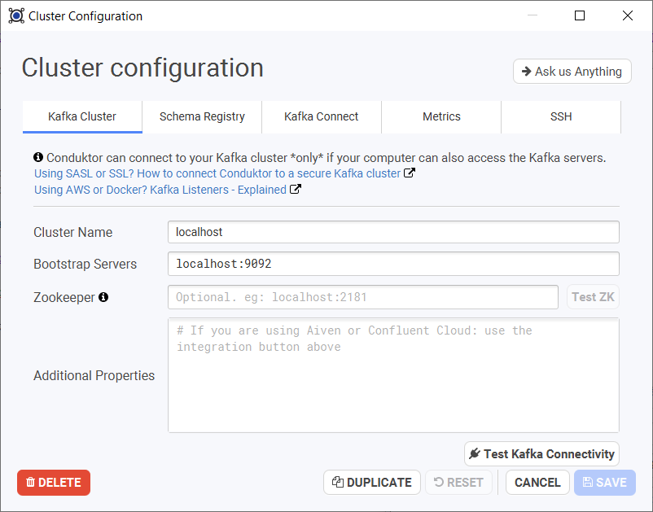
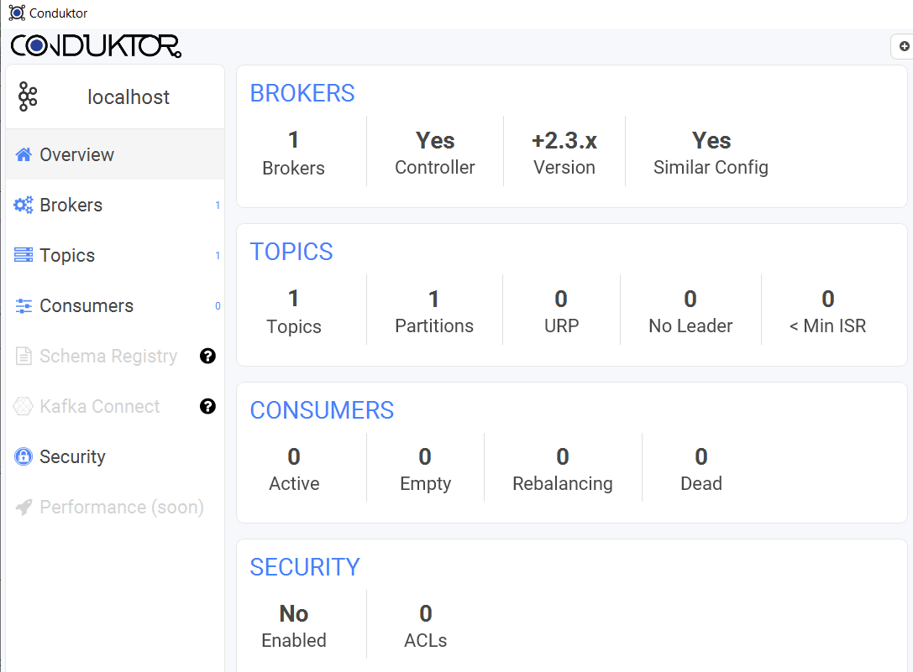
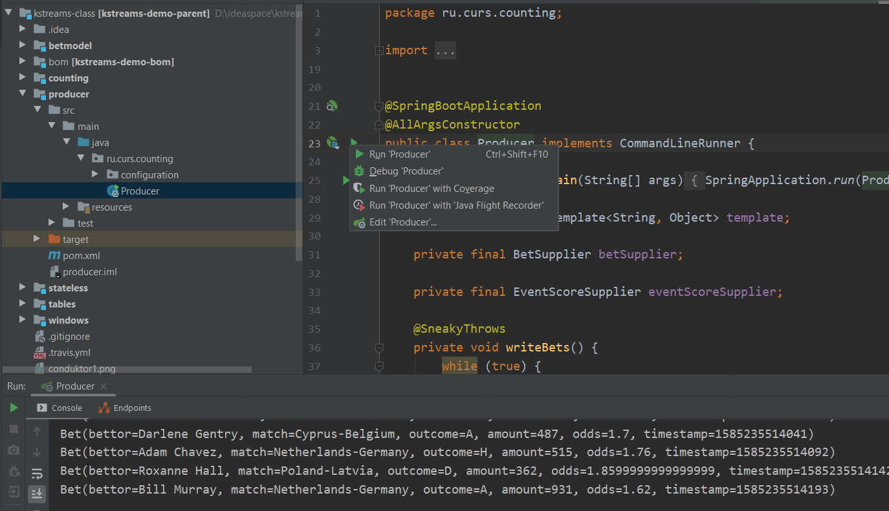

# Kafka Streams Class

[](https://travis-ci.org/inponomarev/kstreams-class)

Заготовка для самостоятельных работ по тренингу Kafka Streams API

* [План занятий](plan.md)

* [Краткое руководство по Zoom](zoom.md)

* [Cheat Sheet по командной строке](cheatsheet.md)

## Инструкция по подготовке к занятию

Для того, чтобы не терять драгоценного времени во время тренинга на скачивание многих сотен мегабайтов из интернета и решение технических проблем, прошу внимательно прочитать и полностью выполнить данную инструкцию _до начала тренинга_.

На вашей машине должны быть установлены: 
  * Вебкамера и микрофон (участие в тренинге происходит при включенной веб-камере и потребует периодического расшаривания экрана!)
  * Docker, 
  * Java 8, 
  * Maven, 
  * IntelliJ IDEA (c Lombok-плагином). 
  
Допустимо использование более свежей версии Java и другой (более привычной вам) IDE, но без гарантии, что я смогу помочь в случае возникновения проблем. 

1. Склонируйте проект https://github.com/inponomarev/kstreams-class себе на локальный диск

2. В корне проекта выполните `docker-compose up`. Эта команда скачает необходимые Docker-образы и запустит мини-кластер Kafka у вас на машине.

3. Проверьте работоспособность Kafka и kafkacat. Для этого залогиньтесь в docker контейнер 

```
docker exec -it kafkacat /bin/bash
```

и выполните команду

```
kafkacat -L -b broker:9092
```

Если вы увидели текст типа "Metadata for all topics... broker1 at localhost:9092", значит c запуском Kafka и kafkacat на вашей машине всё в порядке!

4. Скачайте программу Conduktor. https://www.conduktor.io/ Для запуска потребуется авторизация через Github/Google.

5. Запустите Conduktor, настройте cluster configuration на localhost:9092, как на скриншоте. Проверьте соединение.




6. Войдите в кластер, должна появиться примерно следующая картинка!

 


7. Выполните в корне проекта `mvn clean install`. Эта команда скачает и закеширует необходимые библиотеки. Сборка должна пройти успешно!

8. Откройте проект в IntelliJ IDEA. При необходимости, установите плагин Lombok (Shift-Shift, Plugins, найдите и установите плагин Lombok). После завершения импорта и индексирования, не должно быть "подчёркнутого красным" кода.

9. Убедитесь, что можете запустить модуль Producer (как на скриншоте) и он начинает продуцировать данные в вашу локально развёрнутую Кафку (внизу бежит лог как на скриншоте):

 


Поздравляю, теперь вы полностью готовы к тренингу!

