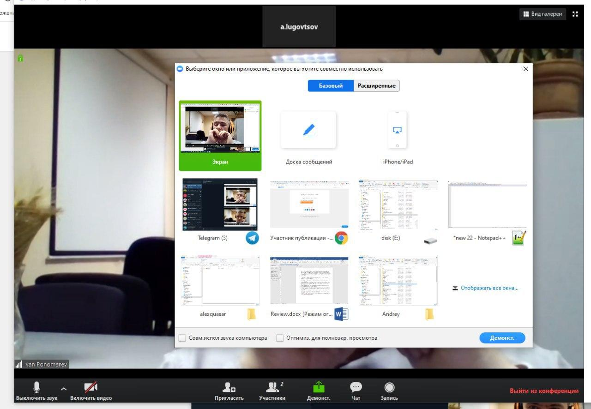
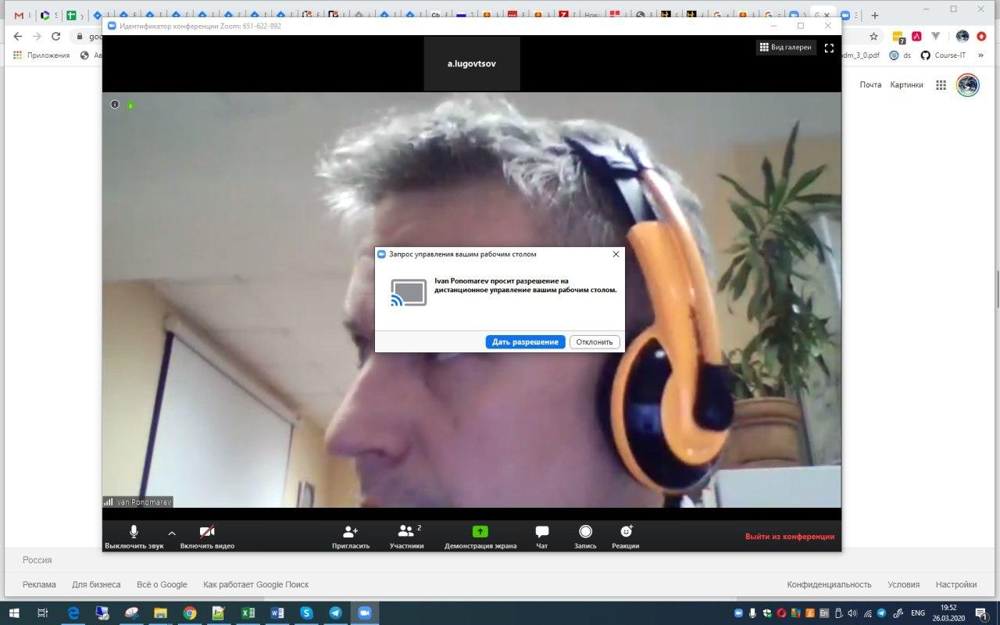

# Zoom

* Ссылка на конференцию присылается перед началом тренинга
* Общий вид приложения следующий:

* Кнопки в нижней панели:

  * Включить/выключить звук: включает/выключает ваш микрофон. 
  Без необходимости говорить лучше держать микрофон выключенным, т. к. это создаёт
  лишний фоновый шум. Руководитель конференции может принудительно
   выключить микрофон (замьютить) участника.
  * Включить/выключить видео: включает/выключает вебкамеру.
  *Все участники тренинга в обязательном порядке сидят с включенными веб-камерами, чтобы
  я видел обратную связь*.
  * Чат: можно написать сообщения в общий чат, если не хочется прерывать голосом.
  * Демонстрация экрана: по договорённости, можно переключиться на демонстрацию собственного экрана.
  При нажатии на кнопку попадаем в выбор окна или приложения для демонстрации:
  

  * Тренера можно попросить о конроле над вашей машиной (помочь что-то сделать). В этом случае
  тренер запросит контроль и вы увидите такое сообщение:
  

 
После утвердительного ответа, тренер получит доступ к вашему рабочему столу.
Правда, работает это медленно, поэтому много чего сделать не удастся.

